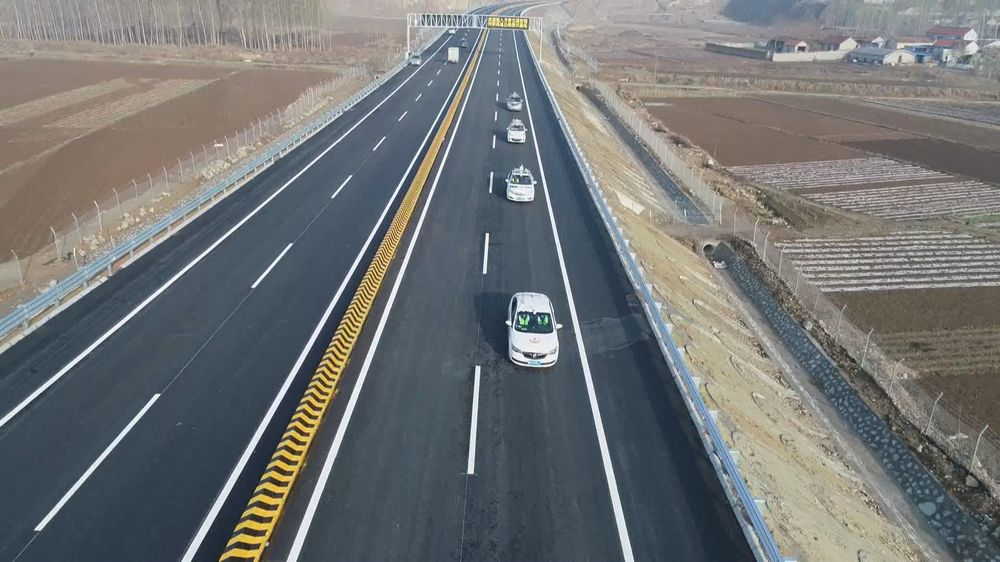
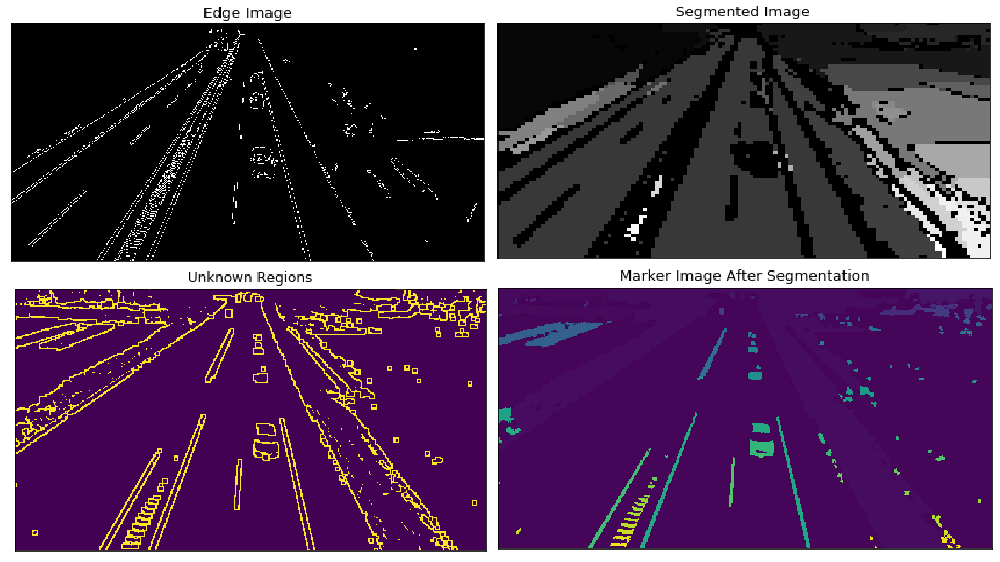
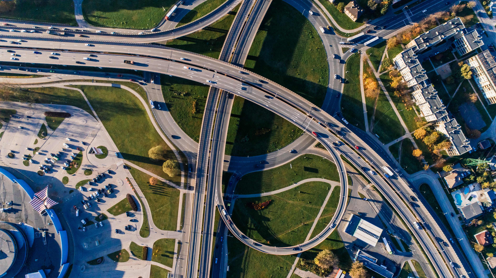
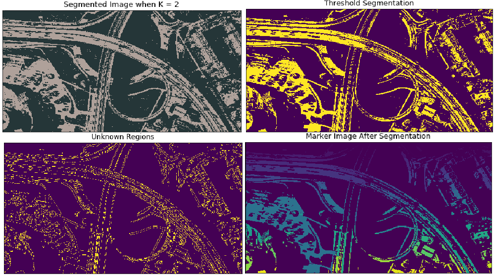

## Different Types of Clustering Techniques - Experimented on Road /Maps of Real images.
> ORIGINAL IMAGE  1

`Result of several Algorithms:`

---
> ORIGINAL IMAGE 2

`Result of several Algorithms:`

`Algorithms Used: K-Means, DBSCAN,  Canny Edge Detection, Watershed Algorithm, Performing Sobel on Clustered Image.`
